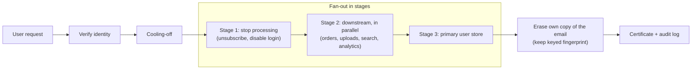
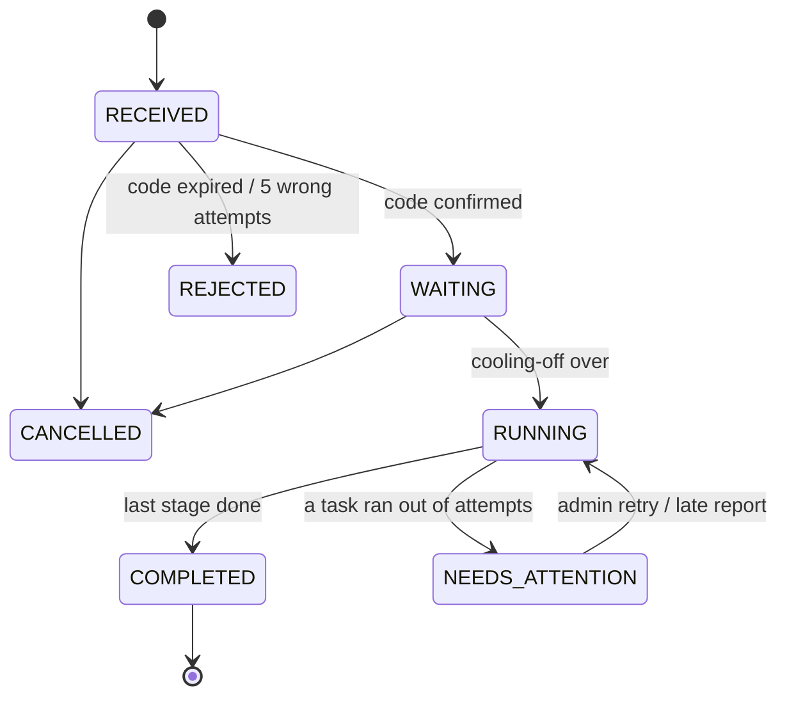
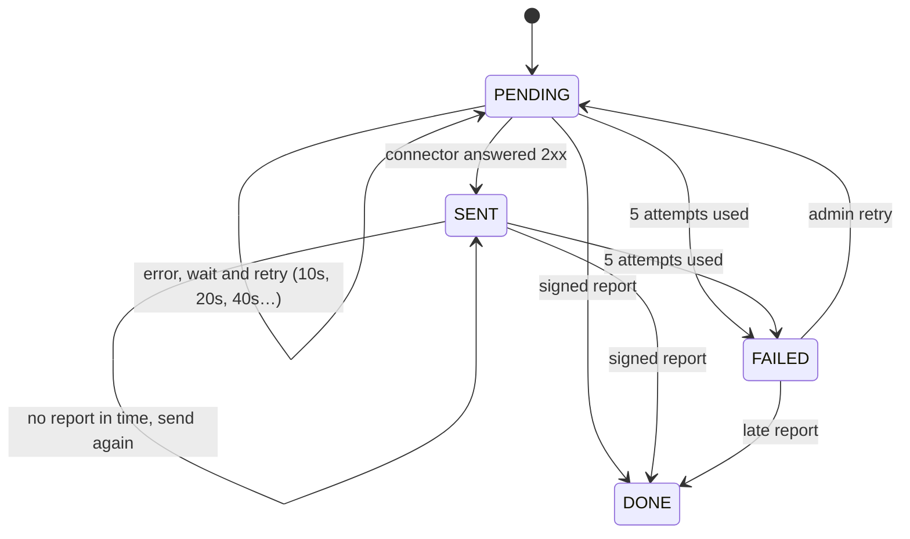

# ForgetMe

> One request in, every system cleaned, proof out.

A self-hosted orchestrator for "delete my data" requests (GDPR Art. 17, India's DPDP Act, CCPA), built with Spring Boot.

**Status:** 🟡 Milestones 1–4 done (25/25 tests passing, full demo run end to end). Requests are verified, fanned out to every registered system stage by stage with signed messages and retries, recorded in a tamper-evident audit log, and closed with a certificate. A Spring Boot starter turns any app into a connector, and one command runs a four-service demo company. Shipping (CI, deploy, admin page) comes in M5. See [ROADMAP.md](ROADMAP.md).

**Try it in one command:** `docker compose --profile demo up --build`, then [delete Alice](#option-a-the-full-demo-one-command).

New here or not a developer? Start with [for-you.md](for-you.md). How each phase works, in plain words: [phase 1](docs/phase-1.md) · [phase 2](docs/phase-2.md) · [phase 3](docs/phase-3.md) · [phase 4](docs/phase-4.md).

---

## The problem

One user's personal data lives in many places: the users database, orders, file uploads, the search index, analytics, the email provider, logs, backups. When that user asks to be deleted, the law sets a deadline (GDPR: one month), and the company must be able to show it actually happened.

Small teams handle this with a spreadsheet and hand-written SQL. Things get missed and there's no proof. Enterprise tools (OneTrust, Transcend, DataGrail) solve it at enterprise prices.

## What ForgetMe does

- ✅ **Verifies** the requester owns the email address before anything runs
- ✅ Tracks the **legal deadline** (30 days) from the moment a request arrives
- ✅ Waits a **cooling-off period** so the user can cancel
- ✅ **Fans out** to every registered system (a *connector*) in a safe order
- ✅ **Retries** connectors that fail or go silent, and escalates to a human when retries run out
- ✅ Records every step in a **tamper-evident audit log** (HMAC hash chain + append-only trigger)
- ✅ Issues a **completion certificate** listing what each system did, pinned to the audit log
- ✅ **Deletes its own copy** of the email when a request finishes, keeping only a keyed fingerprint
- ✅ **Warns the admin** by email at 7 days before the legal deadline, and again if it's missed
- ✅ Ships a **Spring Boot starter** that turns any service into a connector in about 5 lines
- ✅ Comes with a **demo company** (mailing list, orders, uploads, user accounts) that runs with one command

## How it works



**Why stages?** The primary user record is deleted *last*. Until every downstream system is done, the orchestrator still needs the user's identifiers (email, phone, payment customer ID) to find their data. Stages are just numbers on connectors: every connector with the lowest number goes first, in parallel; the next number starts only when all of those have reported back.

### Request lifecycle

Enforced by `RequestStatus.moveTo()`: any move not drawn here throws. Every move goes through `AuditLog.move()`, so each one is also written to the audit log. Reaching a final state (`COMPLETED`, `CANCELLED`, `REJECTED`) erases the stored email.



### Task lifecycle

A task is one connector's share of one request.



### Connector results

| Result | Meaning | Example |
|---|---|---|
| `DELETED` | Data removed | Uploaded profile photos |
| `ANONYMIZED` | Personal fields blanked, record kept | Order rows kept for revenue stats |
| `RETAINED` + note | Kept on purpose, reason recorded | Invoices kept 8 years for tax law |

### Connector protocol

**ForgetMe → connector**

```
POST {endpointUrl}
Content-Type: application/json
X-ForgetMe-Timestamp: 1790090000
X-ForgetMe-Signature: sha256=<hex HMAC-SHA256(secret, "<timestamp>.<body>")>

{"taskId":"…","requestId":"…","email":"alice@example.com","callbackUrl":"http://…/api/callbacks/<taskId>"}
```

Answer any `2xx` to accept the job, then do the work in your own time. Anything else (or no answer within 10 s) counts as a failure and is retried.

**Connector → ForgetMe**, same two headers, signed with the same secret:

```
POST {callbackUrl}
{"result":"DELETED" | "ANONYMIZED" | "RETAINED", "note":"optional, e.g. why data was kept"}
```

Answers: `204` accepted · `401` bad or older-than-5-minutes signature · `400` unreadable · `404` unknown task.

Three rules for connectors: **be idempotent** (the same `taskId` can arrive more than once), **report within `callback-timeout`** (5 min by default) or the job is sent again, and **keep personal data out of `note`**, because notes are copied into the permanent audit log.

### Audit log and certificate

Every event (`RECEIVED`, `WRONG_CODE`, `WAITING`, `RUNNING`, `STAGE_STARTED`, `TASK_DONE`, `TASK_FAILED`, `NEEDS_ATTENTION`, `COMPLETED`, `DEADLINE_WARNING`, …) is appended to `audit_event` with

```
hash = HMAC-SHA256(hash-secret, "audit" ‖ prev_hash ‖ request_id ‖ event ‖ detail ‖ created_at)   (each field length-prefixed)
```

- A trigger rejects `UPDATE` and `DELETE` on the table.
- `GET /api/audit/verify` recomputes the chain from the first event and returns `{intact, eventsChecked, firstBrokenEventId}`.
- `GET /api/requests/{id}/certificate` (only when `COMPLETED`) returns the subject fingerprint (never the email), received/due/completed times, `onTime`, each system's result and note, the request's full history, and `auditHash`, the chain's latest link at issue time. Holding that hash anchors the log outside the database.

## Architecture

```
forgetme/
├── compose.yaml                   Postgres + Mailpit; add --profile demo for the whole demo
├── Dockerfile                     one Maven build → orchestrator and demo images
├── docs/                          plain-English guide to each phase
├── orchestrator/                  Spring Boot app: the brain
│   └── src/main/java/dev/forgetme/
│       ├── RequestController      public + admin endpoints for requests
│       ├── RequestService         file / verify / cancel logic
│       ├── RequestStatus          request lifecycle + allowed transitions
│       ├── PrivacyRequest         JPA entity
│       ├── Dispatcher             timer: starts requests, sends tasks, retries, moves stages
│       ├── Task, Connector        JPA entities
│       ├── ConnectorController    register / list connectors (admin)
│       ├── CallbackController     signed reports from connectors
│       ├── AuditLog               hash-chained event log: append, history, verify
│       ├── ProofController        certificate + audit verification (admin)
│       ├── DeadlineWatcher        timer: emails the admin at 7 days left / overdue
│       ├── Crypto                 AES-GCM, keyed fingerprints, request signing
│       └── SecurityConfig         public vs admin endpoints
├── forgetme-spring-boot-starter/  library any Spring Boot app adds to become a connector
│   └── src/main/java/dev/forgetme/connector/
│       ├── ErasureHandler         the one interface an app implements
│       ├── ErasureResult          DELETED / ANONYMIZED / RETAINED + note
│       ├── ErasureEndpoint        POST /privacy/erase: verify, run handler, report
│       ├── Signatures             same HMAC scheme as the orchestrator
│       └── ForgetMeConnectorAutoConfiguration
└── demo/                          one app, four roles (Spring profiles)
    ├── src/main/java/dev/forgetme/demo/
    │   ├── MailingSystem          stage 1, fails the first try on purpose
    │   ├── OrdersSystem           stage 2, removes the email, RETAINED for tax law
    │   ├── UploadsSystem          stage 2, deletes the customer's folder
    │   └── UsersSystem            stage 3, deletes the account
    └── register-connectors.sh     demo setup step
```

One Maven multi-module build: `orchestrator`, `forgetme-spring-boot-starter`, `demo`.

### Tech stack

| Concern | Choice |
|---|---|
| Language / framework | Java 21, Spring Boot 4.1 |
| Database | PostgreSQL 17 + Flyway migrations |
| Job queue | Postgres `task` table, claimed with `FOR UPDATE SKIP LOCKED` + a lease |
| Timer | Spring `@Scheduled` (every 5 s) |
| Outgoing HTTP | Spring `RestClient` on the JDK `HttpClient` (5 s connect / 10 s read timeouts) |
| Service-to-service auth | HMAC-SHA256 over timestamp + body, per-connector secret |
| Admin auth | Spring Security, HTTP Basic, single admin user |
| PII and secrets at rest | AES-256-GCM (JDK `javax.crypto`) |
| Audit log | HMAC-SHA256 hash chain, Postgres advisory lock for appends, append-only trigger |
| Email (dev) | Mailpit catches outgoing mail locally |
| Connector library | Spring Boot auto-configuration, JDK `HttpClient`, virtual threads |
| Tests | JUnit 5, Testcontainers, fake connectors on the JDK's built-in `HttpServer` |
| Build | Maven wrapper (`mvnw`); multi-stage `Dockerfile` with a Maven cache mount |
| Demo | Docker Compose `demo` profile: orchestrator + 4 services + one-shot setup |
| CI (M5) | GitHub Actions |

### Data model

```
privacy_request (id, status, email_enc (null once finished), subject_hash, code_hash,
                 code_expires_at, code_attempts, received_at, due_at, run_after,
                 closed_at, deadline_alert)
connector       (id, name unique, endpoint_url, secret_enc, stage, created_at)
task            (id, request_id, connector_id, stage, status, result, note, attempts,
                 next_attempt_at, updated_at)       -- unique(request_id, connector_id)
                                                    -- partial index on next_attempt_at for open tasks
audit_event     (id bigserial, request_id, event, detail, created_at, prev_hash, hash)
                                                    -- append-only (trigger)
```

### API

| Method | Path | Caller | Purpose | |
|---|---|---|---|---|
| `POST` | `/api/requests` | public | File a request | ✅ |
| `POST` | `/api/requests/{id}/verify` | public | Confirm with the emailed code | ✅ |
| `POST` | `/api/requests/{id}/cancel` | public | Cancel before deletion starts | ✅ |
| `GET` | `/api/requests/{id}` | admin | Status, deadline and each connector's progress | ✅ |
| `POST` | `/api/requests/{id}/retry` | admin | Retry failed tasks after `NEEDS_ATTENTION` | ✅ |
| `POST` | `/api/connectors` | admin | Register a connector: `name`, `endpointUrl`, `stage`, optional `secret` (32+ chars, else generated). Returns the secret once | ✅ |
| `GET` | `/api/connectors` | admin | List connectors | ✅ |
| `POST` | `/api/callbacks/{taskId}` | connector (signed) | Report a result | ✅ |
| `GET` | `/api/requests/{id}/certificate` | admin | Completion certificate (409 until `COMPLETED`) | ✅ |
| `GET` | `/api/audit/verify` | admin | Re-check the whole audit hash chain | ✅ |

Verify responses: `200` code correct (request is now `WAITING`), `400` wrong code (says how many attempts are left), `410` expired or out of attempts, `409` request isn't awaiting a code.

### A connector in 5 lines: the starter

Add `dev.forgetme:forgetme-spring-boot-starter`, define one bean:

```java
@Bean
ErasureHandler erasure(OrderRepository orders) {
    return subject -> {
        orders.removeEmail(subject.email());
        return ErasureResult.retained("invoices kept 8 years for tax law; email removed");
    };
}
```

and set `forgetme.connector.secret` to the secret ForgetMe returned at registration. Auto-configuration then exposes `POST /privacy/erase`, which:

1. verifies the signature and timestamp (`401` otherwise)
2. runs the handler. An exception → `500`, so ForgetMe retries with backoff
3. answers `202` and sends the signed report to `callbackUrl` on a virtual thread

Handlers must be idempotent: jobs are delivered at least once. If your app uses Spring Security, permit `POST /privacy/erase`; the signature is the authentication.

## Design decisions

| Decision | Why | Revisit when |
|---|---|---|
| Postgres job table, not Kafka | One less system to run; `SKIP LOCKED` gives safe concurrent workers | Throughput outgrows one database |
| Claim tasks with a lease, then send outside the transaction | No database lock is held during a slow HTTP call; if the app crashes mid-send, the lease expires and the task is picked up again | Never |
| Lock order is always request → task | Callbacks and the dispatcher touch both; one fixed order means they can't deadlock | Never |
| Request row locked while deciding the next stage | Otherwise two reports finishing the last two tasks at once could each see the other as still open, and the request would stall | Never |
| Exponential backoff (10 s, 20 s, 40 s, 80 s) | A struggling connector isn't hammered | Real deployments want hours between retries |
| Re-send with the same `taskId` | Connectors can recognize repeats; retries are safe | Never |
| Verify the signature before parsing the body | The signature covers the exact bytes; nothing untrusted is parsed first | Never |
| Connector secrets encrypted, codes hashed | Secrets must be recovered to sign messages; codes only need comparing | Never |
| Explicit `TransactionTemplate` in the dispatcher | Short, visible transactions; avoids the `@Transactional` self-call trap | Never |
| Enum + `moveTo()`, not a state-machine library | 7 states fit in one exhaustive `switch`; adding a state won't compile until its transitions are defined | States and branches multiply |
| Wrong code returns a result instead of throwing | A thrown exception rolls back the transaction, and with it the attempt counter | Never |
| Row lock (`SELECT … FOR UPDATE`) on verify and cancel | Parallel guesses queue up instead of racing past the 5-attempt limit | Never |
| Code stored as HMAC(server key, request ID + code) | A leaked database can't be brute-forced offline, and a hash is useless for any other request | Never |
| Forward-only saga, no rollback | A deletion can't be undone; failures retry or escalate | Never |
| Delete the primary record last | The orchestrator needs identifiers to reach downstream data | Never |
| Hash-chained audit log with HMAC, not plain SHA-256 | Tamper-evident, and someone with database access alone can't recompute the chain after an edit | External notarization is required |
| Append-only trigger *and* a hash chain | The trigger stops casual edits; the chain catches anyone who disables it | Never |
| Certificate carries the chain's latest hash | Anchors the log outside the database, even against someone holding the key | Never |
| Appends serialized with a Postgres advisory lock | Two concurrent appends could otherwise link to the same predecessor and fork the chain | Audit volume outgrows one lock (per-request chains) |
| Timestamps truncated to microseconds before hashing | Postgres stores microseconds; hashing more precision would make every re-verification fail | Never |
| Fields length-prefixed inside the hash | `("AB","C")` and `("A","BC")` can't collide | Never |
| Erase the email on every final state, keep an HMAC fingerprint | The privacy tool shouldn't itself be a PII store; the fingerprint proves who was deleted and allows re-applying deletions after a backup restore | Never |
| Audit details capped at 500 chars | A long connector note must never make a report fail and loop forever | Never |
| Starter API is one functional-interface bean, not annotation scanning | Less magic and less code; it's obvious where the handler comes from | Apps need several handlers |
| Starter runs the handler before answering, reports afterwards | Failures become a fast `500` + backoff instead of a 5-minute callback timeout | Handlers take longer than the 10 s read timeout |
| Signing code duplicated in the starter, pinned by a shared known-answer test | The starter stays dependency-free of the orchestrator; the test catches drift | A third component needs it (extract a protocol module) |
| Connectors may bring their own secret | Scripted setup (the demo, infrastructure-as-code); generated is still the default | Never |
| One demo app, four Spring profiles, in-memory data | One small class per system; the demo exists to show ForgetMe, not storage (MinIO dropped) | Never |

## Security

- A 6-digit one-time code is emailed before anything runs. It's stored only as a keyed hash, expires in 24 hours, is single-use, and 5 wrong attempts reject the request
- Emails and connector secrets are encrypted at rest with AES-256-GCM (random IV per value, tamper-detecting). The email is erased as soon as a request finishes; only a keyed fingerprint remains
- Every event is written to an append-only, HMAC-chained audit log that never contains personal data; deadline alerts to the admin carry only the request ID
- Every orchestrator ↔ connector message is HMAC-SHA256 signed over timestamp + body with a per-connector secret. Messages older than 5 minutes are rejected; a repeat inside that window is harmless because duplicate reports are ignored
- API responses never include the email address
- Request IDs are random UUIDs; everything except file/verify/cancel and signed callbacks requires admin login
- Coming: rate limiting (M5)

**Known gaps (until M5):** the public endpoint has no rate limit, so it could be used to send confirmation emails to arbitrary addresses. Connector URLs are admin-entered and not restricted, so an admin could point one at an internal address. The demo's connector secrets are written in `compose.yaml` and labelled demo-only. Secrets have dev defaults in `application.yml` and must be overridden with `FORGETME_ENCRYPTION_KEY`, `FORGETME_HASH_SECRET` and `FORGETME_ADMIN_PASSWORD` before deploying.

## Getting started

```bash
git clone https://github.com/WIZ4RD-OM24/ForgetMe.git && cd ForgetMe
```

### Option A: the full demo, one command

**Needs:** Docker only. Port 8080 must be free.

```bash
docker compose --profile demo up --build
```

This builds everything and starts ForgetMe, the four demo systems, Postgres and Mailpit. A setup step then registers the systems (wait for `Demo ready`). If you've used this checkout before, `docker compose down -v` first gives you a clean database.

```bash
# Delete Alice. Get the code from http://localhost:8025
curl -s -X POST localhost:8080/api/requests -H 'Content-Type: application/json' -d '{"email":"alice@example.com"}'
curl -s -X POST localhost:8080/api/requests/<id>/verify -H 'Content-Type: application/json' -d '{"code":"<code>"}'

# Watch her disappear (refresh): mailing → uploads + orders → users. Bob stays.
curl -s localhost:8084/data; curl -s localhost:8083/data; curl -s localhost:8082/data; curl -s localhost:8081/data

# About a minute later
curl -s -u admin:admin localhost:8080/api/requests/<id>/certificate
```

Measured on a laptop: done in 48 s (20 s cooling-off, one deliberate retry on mailing, three stages), certificate complete, audit chain intact.

### Option B: develop ForgetMe itself

**Needs:** Java 21 (`JAVA_HOME` must point to it) and Docker.

```bash
docker compose up -d                          # just Postgres + Mailpit
./mvnw -pl orchestrator spring-boot:run       # Windows: .\mvnw.cmd -pl orchestrator spring-boot:run
```

Try it:
```bash
# 1. Register a connector (admin). Save the secret it returns.
curl -s -u admin:admin -X POST localhost:8080/api/connectors -H 'Content-Type: application/json' \
  -d '{"name":"mailing","endpointUrl":"http://localhost:9999/erase","stage":1}'

# 2. File a request, read the code at http://localhost:8025 (Mailpit inbox), confirm it
curl -s -X POST localhost:8080/api/requests -H 'Content-Type: application/json' -d '{"email":"you@example.com"}'
curl -s -X POST localhost:8080/api/requests/<id>/verify -H 'Content-Type: application/json' -d '{"code":"<code>"}'

# 3. After the 1-minute cooling-off, watch the app log and the admin view
curl -s -u admin:admin localhost:8080/api/requests/<id>

# 4. Check the audit chain; get the certificate once a request is COMPLETED
curl -s -u admin:admin localhost:8080/api/audit/verify
curl -s -u admin:admin localhost:8080/api/requests/<id>/certificate
```
Nothing listens on port 9999, so you'll see the retries in the log and the request end in `NEEDS_ATTENTION` after about 2.5 minutes. With no connectors registered, a request completes straight after cooling-off, which is the quickest way to see a certificate. For connectors that really delete things, use Option A.

Dev settings live in `application.yml`: `cooling-off` (1 min), `retry-backoff` (10 s, doubling), `callback-timeout` (5 min), `tick` (5 s), `admin-email` (deadline alerts; lands in Mailpit).

Run the tests:
```bash
./mvnw test
```
This runs all three modules' tests. The orchestrator's end-to-end tests (`RequestFlowTest`) start a throwaway Postgres in Docker and are skipped automatically when Docker isn't running.

## Non-goals

- Legal advice or compliance certification
- Discovering where personal data lives (you register connectors; ForgetMe doesn't scan)
- A rich frontend (a minimal admin page only)

## Prior art

OneTrust, Transcend, DataGrail and Ketch (commercial SaaS); Fides by Ethyca (open source, Python). ForgetMe's angle: lightweight, self-hosted, Java/Spring-native, with a drop-in connector starter.
