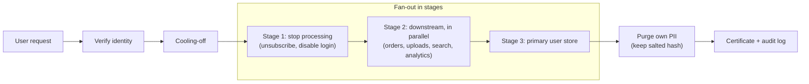
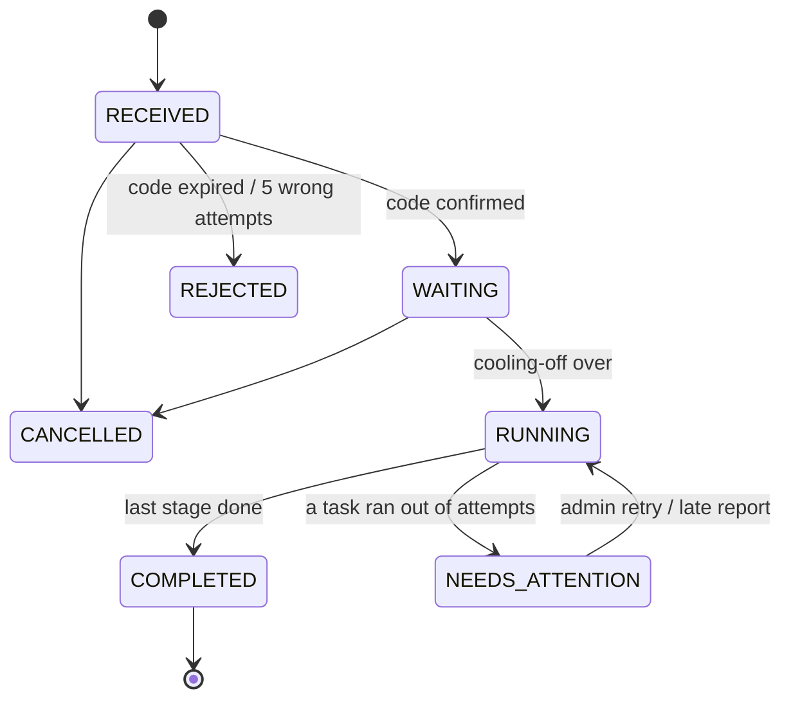
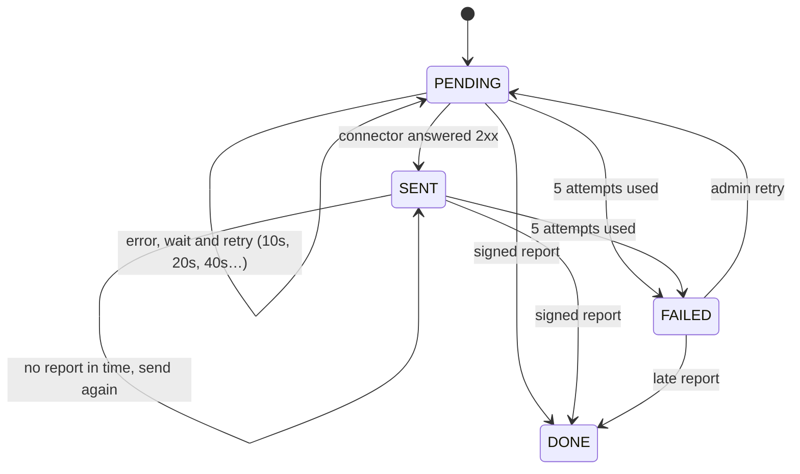

# ForgetMe

> One request in, every system cleaned, proof out.

A self-hosted orchestrator for "delete my data" requests (GDPR Art. 17, India's DPDP Act, CCPA), built with Spring Boot.

**Status:** 🟡 Milestones 1–2 done (14/14 tests passing). Requests are verified, then fanned out to every registered system stage by stage, with signed messages, retries and an admin retry button. Proof and deadlines come in M3. See [ROADMAP.md](ROADMAP.md).

New here or not a developer? Start with [for-you.md](for-you.md). How each phase works, in plain words: [phase 1](docs/phase-1.md) · [phase 2](docs/phase-2.md).

---

## The problem

One user's personal data lives in many places: the users database, orders, file uploads, the search index, analytics, the email provider, logs, backups. When that user asks to be deleted, the law sets a deadline (GDPR: one month), and the company must be able to show it actually happened.

Small teams handle this with a spreadsheet and hand-written SQL. Things get missed and there's no proof. Enterprise tools (OneTrust, Transcend, DataGrail) solve it at enterprise prices.

## What ForgetMe does

- ✅ **Verifies** the requester owns the email address before anything runs
- ✅ Tracks the **legal deadline** (30 days) from the moment a request arrives
- ✅ Waits a **cooling-off period** so the user can cancel
- ✅ **Fans out** to every registered system (a *connector*) in a safe order
- ✅ **Retries** connectors that fail or go silent, and escalates to a human when retries run out
- ⬜ Records every step in a **tamper-evident audit log**
- ⬜ Issues a **completion certificate** listing what each system did
- ⬜ **Deletes its own copy** of the user's identifiers when done, keeping only a salted hash
- ⬜ Ships a **Spring Boot starter** that turns any service into a connector in about 5 lines

## How it works



**Why stages?** The primary user record is deleted *last*. Until every downstream system is done, the orchestrator still needs the user's identifiers (email, phone, payment customer ID) to find their data. Stages are just numbers on connectors: every connector with the lowest number goes first, in parallel; the next number starts only when all of those have reported back.

### Request lifecycle

Enforced by `RequestStatus.moveTo()`: any move not drawn here throws.



### Task lifecycle

A task is one connector's share of one request.



### Connector results

| Result | Meaning | Example |
|---|---|---|
| `DELETED` | Data removed | Uploaded profile photos |
| `ANONYMIZED` | Personal fields blanked, record kept | Order rows kept for revenue stats |
| `RETAINED` + note | Kept on purpose, reason recorded | Invoices kept 8 years for tax law |

### Connector protocol

**ForgetMe → connector**

```
POST {endpointUrl}
Content-Type: application/json
X-ForgetMe-Timestamp: 1790090000
X-ForgetMe-Signature: sha256=<hex HMAC-SHA256(secret, "<timestamp>.<body>")>

{"taskId":"…","requestId":"…","email":"alice@example.com","callbackUrl":"http://…/api/callbacks/<taskId>"}
```

Answer any `2xx` to accept the job, then do the work in your own time. Anything else (or no answer within 10 s) counts as a failure and is retried.

**Connector → ForgetMe**, same two headers, signed with the same secret:

```
POST {callbackUrl}
{"result":"DELETED" | "ANONYMIZED" | "RETAINED", "note":"optional, e.g. why data was kept"}
```

Answers: `204` accepted · `401` bad or older-than-5-minutes signature · `400` unreadable · `404` unknown task.

Two rules for connectors: **be idempotent** (the same `taskId` can arrive more than once), and **report within `callback-timeout`** (5 min by default), or the job is sent again.

## Architecture

```
forgetme/
├── compose.yaml                   Postgres + Mailpit for local dev
├── docs/                          plain-English guide to each phase
├── orchestrator/                  Spring Boot app: the brain
│   └── src/main/java/dev/forgetme/
│       ├── RequestController      public + admin endpoints for requests
│       ├── RequestService         file / verify / cancel logic
│       ├── RequestStatus          request lifecycle + allowed transitions
│       ├── PrivacyRequest         JPA entity
│       ├── Dispatcher             timer: starts requests, sends tasks, retries, moves stages
│       ├── Task, Connector        JPA entities
│       ├── ConnectorController    register / list connectors (admin)
│       ├── CallbackController     signed reports from connectors
│       ├── Crypto                 AES-GCM, code hashing, request signing
│       └── SecurityConfig         public vs admin endpoints
├── forgetme-spring-boot-starter/  (M4) library services add to become connectors
└── demo/                          (M4) users, orders, uploads, mailing-stub services
```

One Maven multi-module build. Modules are added when they get code.

### Tech stack

| Concern | Choice |
|---|---|
| Language / framework | Java 21, Spring Boot 4.1 |
| Database | PostgreSQL 17 + Flyway migrations |
| Job queue | Postgres `task` table, claimed with `FOR UPDATE SKIP LOCKED` + a lease |
| Timer | Spring `@Scheduled` (every 5 s) |
| Outgoing HTTP | Spring `RestClient` on the JDK `HttpClient` (5 s connect / 10 s read timeouts) |
| Service-to-service auth | HMAC-SHA256 over timestamp + body, per-connector secret |
| Admin auth | Spring Security, HTTP Basic, single admin user |
| PII and secrets at rest | AES-256-GCM (JDK `javax.crypto`) |
| Email (dev) | Mailpit catches outgoing mail locally |
| Tests | JUnit 5, Testcontainers, fake connectors on the JDK's built-in `HttpServer` |
| Build | Maven wrapper (`mvnw`) |
| CI (M5) | GitHub Actions |

### Data model

Built so far:
```
privacy_request (id, status, email_enc, code_hash, code_expires_at, code_attempts,
                 received_at, due_at, run_after)
connector       (id, name unique, endpoint_url, secret_enc, stage, created_at)
task            (id, request_id, connector_id, stage, status, result, note, attempts,
                 next_attempt_at, updated_at)       -- unique(request_id, connector_id)
                                                    -- partial index on next_attempt_at for open tasks
```
Planned:
```
audit_event (id, request_id, event, payload, prev_hash, hash)    -- M3
privacy_request.subject_hash                                     -- M3
```

### API

| Method | Path | Caller | Purpose | |
|---|---|---|---|---|
| `POST` | `/api/requests` | public | File a request | ✅ |
| `POST` | `/api/requests/{id}/verify` | public | Confirm with the emailed code | ✅ |
| `POST` | `/api/requests/{id}/cancel` | public | Cancel before deletion starts | ✅ |
| `GET` | `/api/requests/{id}` | admin | Status, deadline and each connector's progress | ✅ |
| `POST` | `/api/requests/{id}/retry` | admin | Retry failed tasks after `NEEDS_ATTENTION` | ✅ |
| `POST` | `/api/connectors` | admin | Register a connector (returns its secret once) | ✅ |
| `GET` | `/api/connectors` | admin | List connectors | ✅ |
| `POST` | `/api/callbacks/{taskId}` | connector (signed) | Report a result | ✅ |
| `GET` | `/api/requests/{id}/certificate` | admin | Completion certificate | M3 |
| `GET` | `/api/audit/verify` | admin | Re-check the audit hash chain | M3 |

Verify responses: `200` code correct (request is now `WAITING`), `400` wrong code (says how many attempts are left), `410` expired or out of attempts, `409` request isn't awaiting a code.

### A connector in 5 lines (planned, M4)

```java
@ErasureHandler
ErasureResult erase(Subject subject) {
    orderRepo.anonymizeByCustomer(subject.userId());
    return ErasureResult.retained("invoices kept 8 years: tax law");
}
```

The starter will handle signature checks, idempotency and the report.

## Design decisions

| Decision | Why | Revisit when |
|---|---|---|
| Postgres job table, not Kafka | One less system to run; `SKIP LOCKED` gives safe concurrent workers | Throughput outgrows one database |
| Claim tasks with a lease, then send outside the transaction | No database lock is held during a slow HTTP call; if the app crashes mid-send, the lease expires and the task is picked up again | Never |
| Lock order is always request → task | Callbacks and the dispatcher touch both; one fixed order means they can't deadlock | Never |
| Request row locked while deciding the next stage | Otherwise two reports finishing the last two tasks at once could each see the other as still open, and the request would stall | Never |
| Exponential backoff (10 s, 20 s, 40 s, 80 s) | A struggling connector isn't hammered | Real deployments want hours between retries |
| Re-send with the same `taskId` | Connectors can recognize repeats; retries are safe | Never |
| Verify the signature before parsing the body | The signature covers the exact bytes; nothing untrusted is parsed first | Never |
| Connector secrets encrypted, codes hashed | Secrets must be recovered to sign messages; codes only need comparing | Never |
| Explicit `TransactionTemplate` in the dispatcher | Short, visible transactions; avoids the `@Transactional` self-call trap | Never |
| Enum + `moveTo()`, not a state-machine library | 7 states fit in one exhaustive `switch`; adding a state won't compile until its transitions are defined | States and branches multiply |
| Wrong code returns a result instead of throwing | A thrown exception rolls back the transaction, and with it the attempt counter | Never |
| Row lock (`SELECT … FOR UPDATE`) on verify and cancel | Parallel guesses queue up instead of racing past the 5-attempt limit | Never |
| Code stored as HMAC(server key, request ID + code) | A leaked database can't be brute-forced offline, and a hash is useless for any other request | Never |
| Forward-only saga, no rollback | A deletion can't be undone; failures retry or escalate | Never |
| Delete the primary record last | The orchestrator needs identifiers to reach downstream data | Never |
| Hash-chained audit log (M3) | Tamper-evident in about 20 lines | External notarization is required |
| Purge PII after completion, keep a salted hash (M3) | The privacy tool shouldn't itself be a PII store; the hash allows re-applying deletions after a backup restore | Never |

## Security

- A 6-digit one-time code is emailed before anything runs. It's stored only as a keyed hash, expires in 24 hours, is single-use, and 5 wrong attempts reject the request
- Emails and connector secrets are encrypted at rest with AES-256-GCM (random IV per value, tamper-detecting)
- Every orchestrator ↔ connector message is HMAC-SHA256 signed over timestamp + body with a per-connector secret. Messages older than 5 minutes are rejected; a repeat inside that window is harmless because duplicate reports are ignored
- API responses never include the email address
- Request IDs are random UUIDs; everything except file/verify/cancel and signed callbacks requires admin login
- Coming: hash-chained audit log (M3), rate limiting (M5)

**Known gaps (until M5):** the public endpoint has no rate limit, so it could be used to send confirmation emails to arbitrary addresses. Connector URLs are admin-entered and not restricted, so an admin could point one at an internal address. Secrets have dev defaults in `application.yml` and must be overridden with `FORGETME_ENCRYPTION_KEY`, `FORGETME_CODE_SECRET` and `FORGETME_ADMIN_PASSWORD` before deploying.

## Getting started

**Needs:** Java 21 (`JAVA_HOME` must point to it) and Docker.

```bash
git clone https://github.com/WIZ4RD-OM24/ForgetMe.git && cd ForgetMe
docker compose up -d                          # Postgres + Mailpit
./mvnw -pl orchestrator spring-boot:run       # Windows: .\mvnw.cmd -pl orchestrator spring-boot:run
```

Try it:
```bash
# 1. Register a connector (admin). Save the secret it returns.
curl -s -u admin:admin -X POST localhost:8080/api/connectors -H 'Content-Type: application/json' \
  -d '{"name":"mailing","endpointUrl":"http://localhost:9999/erase","stage":1}'

# 2. File a request, read the code at http://localhost:8025 (Mailpit inbox), confirm it
curl -s -X POST localhost:8080/api/requests -H 'Content-Type: application/json' -d '{"email":"you@example.com"}'
curl -s -X POST localhost:8080/api/requests/<id>/verify -H 'Content-Type: application/json' -d '{"code":"<code>"}'

# 3. After the 1-minute cooling-off, watch the app log and the admin view
curl -s -u admin:admin localhost:8080/api/requests/<id>
```
Nothing listens on port 9999, so you'll see the retries in the log and the request end in `NEEDS_ATTENTION` after about 2.5 minutes. Real demo connectors arrive in M4.

Dev timings live in `application.yml`: `cooling-off` (1 min), `retry-backoff` (10 s, doubling), `callback-timeout` (5 min), `tick` (5 s).

Run the tests:
```bash
./mvnw test
```
The end-to-end tests (`RequestFlowTest`) start a throwaway Postgres in Docker and are skipped automatically when Docker isn't running.

## Non-goals

- Legal advice or compliance certification
- Discovering where personal data lives (you register connectors; ForgetMe doesn't scan)
- A rich frontend (a minimal admin page only)

## Prior art

OneTrust, Transcend, DataGrail and Ketch (commercial SaaS); Fides by Ethyca (open source, Python). ForgetMe's angle: lightweight, self-hosted, Java/Spring-native, with a drop-in connector starter.
